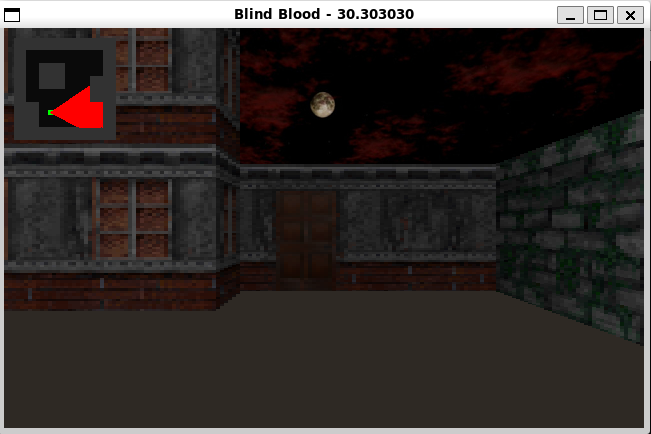

# Blind Blood

Blind Blood is a vanilla C++ first-person shooter (FPS) game that uses a raycasting technique to render the environment. Inspired by classic FPS games like *Blood*, it features retro-style graphics, immersive gameplay, and a unique blend of visual and audio effects.

## Screenshots



## Description

In Blind Blood, players navigate through a maze-like environment, battling enemies and solving puzzles. The game employs a minimalist design with a focus on gameplay mechanics and atmosphere. The raycasting technique provides a pseudo-3D experience, reminiscent of early FPS games from the 90s.

### Features:

The game is built using SDL2, and it includes features like:

- **Retro Graphics**: Classic pixelated textures and sprites.
- **Raycasting Engine**: Efficient rendering for a nostalgic FPS experience.
- **Audio Effects**: Immersive sound effects and background music.
- **Customizable Gameplay**: Modify textures, sounds, and maps to create your own levels.

## How to Play

1. Use the arrow keys to move and turn.
2. Explore the map, avoid obstacles, and interact with the environment.
3. Enjoy the retro FPS experience!

## Build and Run

To build and run the game, use the provided `Makefile`:

```bash
make build
make run
